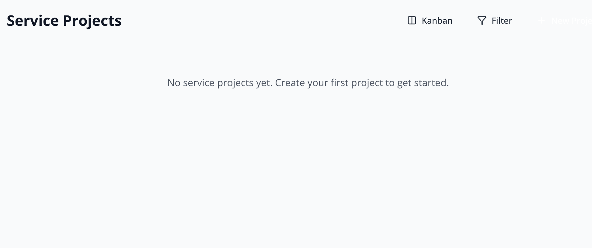

# Supabase Storage Setup - Service Project Images

**Role**: CEO only (requires Supabase dashboard access)
**Duration**: 5 minutes
**Frequency**: One-time setup

---

## Context
Service Projects feature requires image storage. Supabase Storage provides integrated, CDN-backed storage with China-friendly global delivery.

---

## Setup Steps

### 1. Access Supabase Dashboard
- Navigate to: https://supabase.com/dashboard
- Sign in to Georgetown Rotary project
- Click **Storage** in left sidebar

### 2. Create Storage Bucket
- Click **"New bucket"** button
- **Bucket name**: `project-images`
- **Public bucket**: ✅ **Enable** (allows public URL access)
- Click **"Create bucket"**

### 3. Configure Bucket Settings (Optional)
Default settings are fine for MVP. Advanced options:
- **File size limit**: 5 MB (default is fine)
- **Allowed MIME types**: `image/jpeg`, `image/png`, `image/webp` (leave as "All" for MVP)

### 4. Verify Bucket Policies
Supabase auto-creates policies for public buckets. Verify:
- Navigate to **Storage > Policies**
- Should see policies for `project-images` bucket:
  - ✅ Public read access
  - ✅ Authenticated insert access

If policies don't exist, create them:

```sql
-- Allow authenticated users to upload
CREATE POLICY "Authenticated users can upload project images"
ON storage.objects FOR INSERT
TO authenticated
WITH CHECK (bucket_id = 'project-images');

-- Allow public read access
CREATE POLICY "Project images are publicly accessible"
ON storage.objects FOR SELECT
TO public
USING (bucket_id = 'project-images');

-- Allow authenticated users to delete
CREATE POLICY "Authenticated users can delete project images"
ON storage.objects FOR DELETE
TO authenticated
USING (bucket_id = 'project-images');
```

---

## Verification

### Test Upload (Browser Console)
After CTO implements upload component, verify in browser:

1. Open app in browser
2. Navigate to Service Projects
3. Create new project with image upload
4. Check Supabase Storage dashboard
5. Confirm image appears in `project-images` bucket

### Public URL Format
Uploaded images will have URLs like:
```
https://[project-id].supabase.co/storage/v1/object/public/project-images/[filename]
```

---

## Troubleshooting

**Images not uploading?**
- Check bucket exists and is public
- Verify RLS policies allow authenticated inserts
- Check browser console for errors

**Images not displaying?**
- Verify public read policy exists
- Check URL format matches expected pattern
- Test URL directly in browser

**Storage quota exceeded?**
- Free tier: 1 GB storage
- Upgrade plan if needed (unlikely for ~50 images)
- Compress images before upload (CTO handles this)

---

## Next Steps for CTO
Once bucket is created, CTO can:
1. Implement image upload component
2. Test upload/display functionality
3. Integrate with Service Projects CRUD
